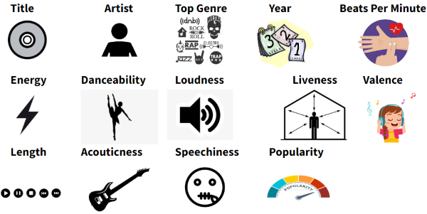
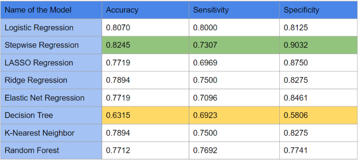
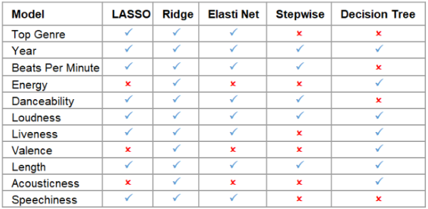

# Song-Popularity-Prediction

## Introduction

Music is the most effective form of art that has the capacity to make humans feel all types of emotions and 
deeply impacts the minds and hearts of people. The project aims to comprehend the parameters involved in 
making a song popular and understand the factors that contribute to a song’s success or failure and reveals 
which attributes influence a listener’s inclination to a song the most.

  

## Motivation

Comprehending the reasons behind popularity of a song has major business implications to industries that 
thrive on popular music, namely radio stations, record labels, and digital and physical music marketplaces. 
The ability to make accurate predictions of song popularity also has implications for customized music 
suggestions and to help artists and record labels maximize commercial return is to use a model to predict 
whether their music will be popular on streaming platforms. Music online platforms like Spotify, Apple 
Music, Pandora train their algorithms to recommend music based on the user’s preferences. Predicting 
popular songs can be extended to identify user preferences among different population segments which can 
enable the ability to tailor streaming apps and radio stations to understand the needs of the audience and 
helps in predicting preferred songs for that segment of population.

  

## Dataset

The data was sourced from Kaggle, an online platform allowing users to find data sets.

The following key observations were uncovered while performing EDA:

- The frequency of the number of hit songs in the data were predominantly present from 1965 and 
increased in a linear fashion through the horizon until 2015.
- The average beats per minute of popular songs lie between 100-140 BPM.
- The energy of the popular songs has a direct relation, with an average of 60-80 dB
- The dance-ability of songs follows a normal distribution with the average danceability of the song 
is approximately 50-60%.
- Most of the popular songs exhibit a loudness from -13 to -7 dB, as indicated by the graph above.
- Predominantly, popular songs have less liveness, indicating that the songs were recorded in a 
studio.
- For valence of the song, it indicated that there is no trend observed with valence and popularity of 
songs.
- Popular songs are usually in the length of 200-300 seconds.
- Electronic music has higher popularity, compared to country music which have higher 
acousticness.

  

## Approach

Various regression methods were explored to model the data. Since the response variable was transformed 
from a numerical variable to a binary response variable, regression techniques that have a logit link function 
were chosen. Linear regression is not appropriate to answer Yes/No questions as it does not adequately 
capture the behavior of music charts. There are a lot of features in the dataset, and some of them may not 
be that significant. Hence, variable selection models were also used. Ensemble learning and non-parametric 
supervised learning have been gaining a lot of popularity due to their high accuracy and ability to generalize 
well on data. This type of learning was also adapted in this project. The regression models implemented in 
this project are listed below and explained in detail:

- Logistic Regression
- Stepwise Regression
- Lasso Regression 
- Ridge Regression
- Elastic Net Regression
- K-Nearest Neighbor
- Decision Tree
- Random Forest

## Discussion and Results

It is observed that most models have accuracy, sensitivity, and specificity in the 
70-80% range. Based on the results and prediction accuracy of the various models, it is determined that 
stepwise linear regression has the highest predicting accuracy and decision tree model has the least 
prediction accuracy.

  

It is found that Stepwise regression is the best model for predicting popularity of a song and reduces the 
most number of variables and selects only 5 of the 11 attributes available for its model, namely Year, Beats 
Per Minute, Danceability, Loudness and Length. This seems logical as some of the variables were highly 
correlated to each other as we found in our EDA. It was interesting to find that Year was one of the 
significant features in predicting a song’s popularity. However, this can be explained as a song’s year is 
correlated with other attributes such as Loudness and Danceability.

  

